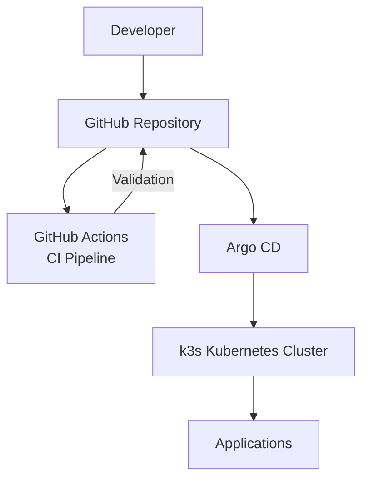
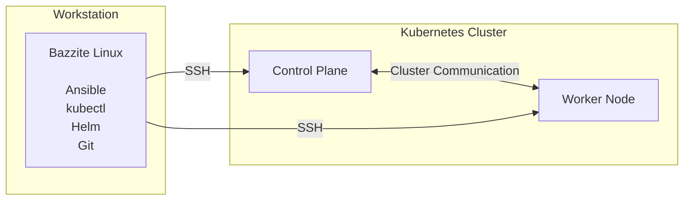
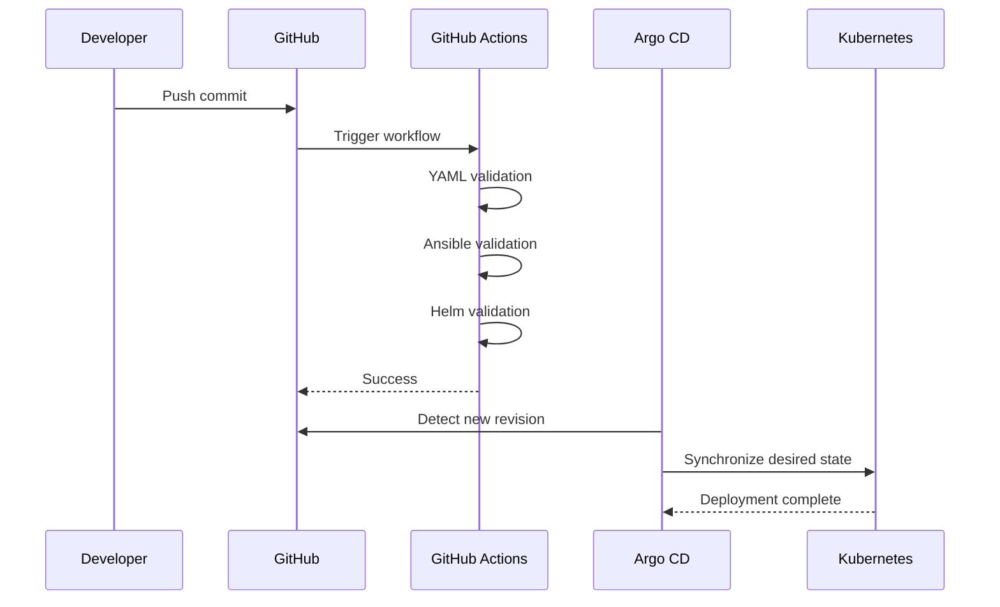

# Architecture

## Overview

This document describes the architecture of the Platform Engineering homelab and how the individual components interact to provide a modern Infrastructure as Code and GitOps workflow.

The environment is intentionally designed to resemble a simplified enterprise platform rather than a collection of standalone servers. Configuration, validation and application deployment are all managed through version-controlled code.

---

# Architecture Principles

The platform is built around the following principles:

- Infrastructure as Code
- Git as the single source of truth
- Automated validation through Continuous Integration
- GitOps-based Continuous Delivery
- Kubernetes-native application deployment
- Reproducible infrastructure

---

# High-Level Architecture

---

# Infrastructure

---

# Platform Components

## Development Workstation

The workstation acts as the engineering workstation from which the platform is managed.

Responsibilities include:

- Git development
- Infrastructure automation using Ansible
- Kubernetes administration
- Helm chart development
- Git repository management

Although the workstation runs Bazzite Linux, all engineering tooling is executed inside a Distrobox container, providing an isolated and reproducible development environment.

---

## Kubernetes Cluster

The Kubernetes cluster provides the runtime platform for applications.

The current cluster consists of:

- One control plane
- One worker node

The cluster hosts:

- Argo CD
- Grafana
- Monitoring components
- Demonstration workloads

---

## Continuous Integration

GitHub Actions validates every commit before it becomes part of the repository.

Current validation includes:

- YAML linting
- Ansible syntax validation
- Helm chart validation
- Helm template rendering

This prevents invalid configuration from entering the main branch.

---

## Continuous Delivery

Application deployment follows GitOps principles.

Argo CD continuously compares the Kubernetes cluster with the desired state stored in Git.

When differences are detected, Argo CD automatically reconciles the cluster to match the repository.

This removes the need for manual deployment commands.

---

## Deployment Workflow

---

# Technology Stack

| Technology | Purpose |
|------------|---------|
| Linux | Platform administration |
| Git | Source control |
| GitHub | Repository hosting |
| GitHub Actions | Continuous Integration |
| Ansible | Infrastructure automation |
| Kubernetes (k3s) | Container orchestration |
| Helm | Application packaging |
| Argo CD | GitOps deployment |
| Grafana | Monitoring |

---

# Future Development

Planned improvements include:

- Terraform
- Prometheus
- Alertmanager
- cert-manager
- External Secrets
- High Availability Kubernetes
- Network Policies
- Backup and disaster recovery
