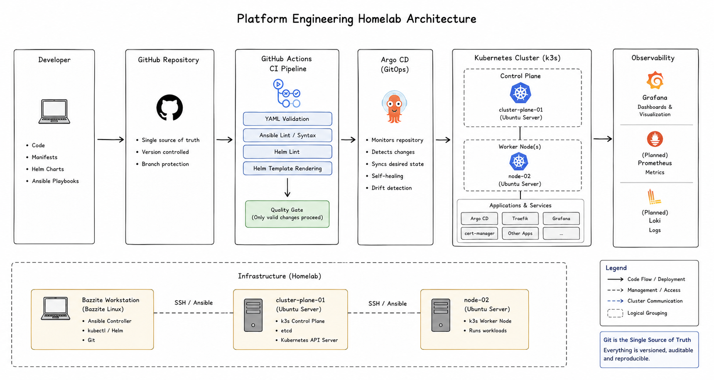

# Architecture

## Purpose

This document gives an overview of how the homelab is put together and why I made the architectural choices that I did.

I wanted to build a platform where each component has a clear responsibility rather than just installing technologies for the sake of it. Every major component should support the overall goal of creating a manageable and reproducible Platform Engineering environment.

---

## Scope

This document covers:

* The overall platform architecture
* How the different components interact
* High-level deployment flow
* Design decisions
* The reasoning behind the chosen technologies

More detailed information about Kubernetes, Ansible, GitOps and monitoring can be found in their respective chapters.

---

## Platform Architecture

  

At a high level, everything starts with Git.

Infrastructure changes are committed to the repository, validated through GitHub Actions, and then synchronized to the Kubernetes cluster by Argo CD.

This means I spend very little time making manual changes directly on the servers. Instead, I try to let the platform manage itself whenever possible.

---

## The Building Blocks

The platform is made up of a handful of core components.

| Component           | Purpose                        |
| ------------------- | ------------------------------ |
| Bazzite Workstation | Development and administration |
| GitHub              | Source control                 |
| GitHub Actions      | Configuration validation       |
| Ansible             | Infrastructure automation      |
| Kubernetes (k3s)    | Application platform           |
| Helm                | Kubernetes package management  |
| Argo CD             | GitOps deployment              |
| Grafana             | Platform monitoring            |

Each tool solves a specific problem, and together they create a workflow that feels much closer to a real Platform Engineering environment than a traditional homelab.

---

## How Everything Fits Together

A typical change follows roughly this flow:

1. I make a change to the repository.
2. GitHub Actions validates the change.
3. If the validation succeeds, Argo CD detects the update.
4. Argo CD synchronizes the Kubernetes cluster.
5. The updated application or configuration becomes active.

That means Git becomes the central point for almost every change I make.

---

## Design Decisions

While building the platform, I tried to make decisions that balanced learning value with operational simplicity.

### Why k3s?

I wanted a Kubernetes distribution that behaves like upstream Kubernetes but is lightweight enough to run comfortably on my available hardware.

k3s gave me exactly that while remaining compatible with the wider Kubernetes ecosystem.

---

### Why Ansible?

One of my goals was to stop configuring servers manually.

Using Ansible means I can rebuild infrastructure or repeat configuration changes without relying on memory or handwritten notes.

---

### Why GitHub Actions?

Even in a small homelab it's surprisingly easy to introduce YAML mistakes or configuration errors.

Running automated validation before changes become part of the repository gives me much more confidence when making changes.

---

### Why Argo CD?

I liked the idea of the cluster continuously comparing itself against Git.

If I accidentally change something manually, Argo CD helps bring the cluster back to the expected state.

That fits well with the overall goal of keeping Git as the source of truth.

---

### Why Grafana?

As the platform grows, I don't want to rely on guessing whether everything is healthy.

Grafana gives me a single place to check the status of the cluster and, later, application metrics and logs.

---

## Keeping Things Simple

One thing I've learned while building this project is that it's easy to make a homelab more complicated than it needs to be.

Whenever I consider adding a new technology, I usually ask myself two questions:

* Does it solve a problem I actually have?
* Will I learn something useful from implementing it?

If the answer to both questions is "yes", it probably belongs in the platform.

Otherwise, I'd rather wait until there's a real reason to introduce it.

---

## Current Architecture

At the moment the platform consists of:

* One management workstation
* One Kubernetes control-plane node
* One Kubernetes worker node
* Git-based configuration management
* Automated validation through GitHub Actions
* GitOps deployment using Argo CD
* Platform monitoring with Grafana

It's intentionally a small environment, but it's large enough to explore many of the workflows used in professional Platform Engineering teams.

---

## Key Takeaways

* The platform is designed around Git as the central source of truth.
* Every major component has a clearly defined responsibility.
* Automation is preferred over manual administration.
* The architecture is intentionally kept simple while still reflecting common Platform Engineering practices.
* New technologies are only added when they solve a real problem or support a learning objective.

---

## Related Documentation

If you'd like to dive deeper into individual parts of the platform, continue with:

* [03-kubernetes.md](03-kubernetes.md)
* [04-ansible.md](04-ansible.md)
* [05-ci-cd.md](05-ci-cd.md)
* [06-argocd-gitops.md](06-argocd-gitops.md)
