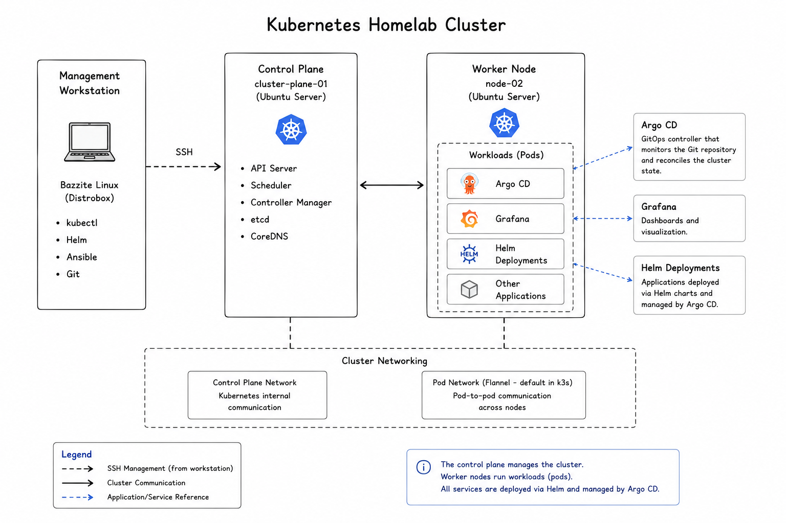

# Kubernetes

## Purpose

Kubernetes is the core of this homelab.

I chose to use it because many modern platforms are built around container orchestration, and I wanted practical experience managing applications in a Kubernetes environment rather than just reading about it.

This document gives an overview of how my cluster is structured and why I chose k3s.

---

## Cluster Overview

  

The cluster currently consists of:

| Node             | Role          |
| ---------------- | ------------- |
| cluster-plane-01 | Control Plane |
| node-02          | Worker Node   |

It's a small cluster, but large enough to explore scheduling, deployments, networking and GitOps workflows.

---

## Why k3s?

I chose k3s because it's lightweight, easy to manage and behaves very much like a standard Kubernetes cluster.

That means I can learn the concepts that apply to larger environments without needing a rack full of servers.

For this project it struck a good balance between simplicity and functionality.

---

## What Runs on the Cluster?

At the moment the cluster hosts the platform components themselves, including:

* Argo CD
* Grafana
* Ingress Controller
* Sample applications used for testing

As the project grows, more services will be added, but I'd rather introduce them gradually than deploy everything at once.

---

## Deploying Applications

Most applications are deployed using Helm charts and managed through Argo CD.

That means I normally don't deploy workloads manually with `kubectl`.

Instead, I update the Git repository and let Argo CD synchronize the cluster.

This gives me a workflow that's much closer to how many Platform Engineering teams work.

---

## Working with the Cluster

When I interact with Kubernetes, I mainly use:

* `kubectl`
* Helm
* Argo CD

Most day-to-day tasks involve:

* Checking node status
* Viewing pods
* Looking at logs
* Deploying or updating applications
* Troubleshooting failed deployments

The goal has been to become comfortable using Kubernetes as part of a normal workflow rather than simply learning individual commands.

---

## Things I've Learned

Building this cluster has taught me much more than simply installing Kubernetes.

Some of the topics I've spent the most time understanding include:

* Pods and Deployments
* Services
* Ingress
* Namespaces
* Helm charts
* GitOps workflows
* Troubleshooting Kubernetes resources

Like most Kubernetes users, I've also learned that reading logs is often the quickest path to finding a problem.

---

## Design Decisions

While building the cluster, I tried to keep a few things in mind.

### Keep it Small

It's tempting to add more nodes, more applications and more complexity.

For now, I'd rather have a platform that I fully understand than one that's unnecessarily complicated.

---

### Automate Deployments

Whenever possible, deployments should happen through Git instead of manually applying YAML files.

That keeps the cluster consistent and makes changes easier to track.

---

### Learn One Thing at a Time

Kubernetes is already a large ecosystem.

Instead of installing every popular tool immediately, I prefer adding new components only after I understand the ones already in use.

That approach has made the learning process much more manageable.

---

## Future Improvements

Some areas I'd like to explore in the future include:

* High Availability control planes
* Persistent storage
* Better monitoring
* Network Policies
* cert-manager
* Longhorn
* Multi-cluster management

Some of these may eventually become part of the platform, while others are simply technologies I'd like to gain experience with.

---

## Key Takeaways

* Kubernetes is the foundation of the platform.
* I chose k3s because it provides a good balance between simplicity and functionality.
* Most deployments happen through GitOps rather than manual commands.
* The cluster is intentionally kept small so it's easier to understand and maintain.
* New technologies are introduced gradually as the project evolves.

---

## Related Documentation

The next chapters describe how the cluster is managed and updated.

* [04-ansible.md](04-ansible.md)
* [05-ci-cd.md](05-ci-cd.md)
* [06-argocd-gitops.md](06-argocd-gitops.md)
