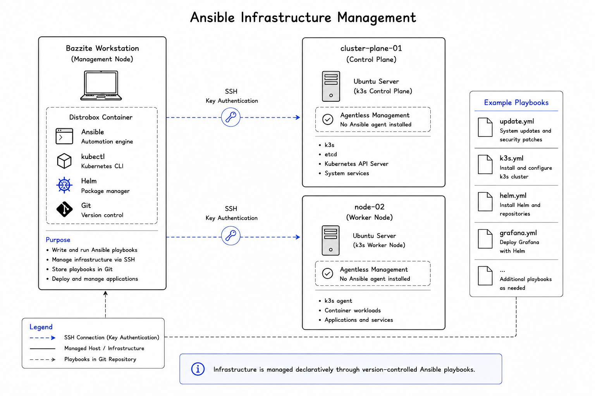

# Ansible

## Purpose

One of the first things I wanted to avoid in this project was manually configuring servers.

If I needed to rebuild a machine or repeat a configuration, I didn't want to rely on memory or handwritten notes.

That's why I chose Ansible as the primary tool for infrastructure automation.

As the platform has developed, Ansible has also become an operational tool for health checks, maintenance and interacting with APIs.

---

## What Ansible Manages

<p align="center">
  
</p>

Ansible runs from a Distrobox container on my Bazzite workstation and manages the Ubuntu servers over SSH using key-based authentication.

It is currently used for tasks such as:

- Installing and updating packages
- Preparing and configuring servers
- Installing Kubernetes components
- Installing Helm
- Deploying supporting platform components
- Performing health checks
- Running maintenance workflows
- Interacting with REST APIs

Whenever possible, I'd rather describe a repeatable process in a playbook than rely on manually repeating commands.

---

## Why Ansible?

Before starting this project, most of my Linux administration was done manually.

That works well enough with a small number of machines, but becomes increasingly repetitive and difficult to reproduce as an environment grows.

Using Ansible has helped me move from thinking about individual commands toward thinking about desired processes and repeatable operations.

Because Ansible is agentless, the managed servers don't require an Ansible agent. Management is performed remotely over SSH from the Ansible controller.

---

## How I Use It

The playbooks are stored in the Git repository alongside the rest of the project.

This means infrastructure and operational automation can be version controlled in the same way as other platform configuration.

A typical workflow is:

1. Update or create a playbook.
2. Test the playbook against the homelab.
3. Verify the resulting state.
4. Commit the change to Git.
5. Reuse the playbook when the operation is needed again.

Keeping the automation in Git also provides a history of how the platform and its operational procedures have evolved.

---

## Building Playbooks

Most playbooks focus on a specific responsibility.

Examples include:

- Installing software
- Updating operating systems
- Deploying Helm charts
- Preparing Kubernetes nodes
- Installing platform components
- Checking platform health
- Performing maintenance

Keeping individual playbooks focused makes them easier to understand, troubleshoot and reuse.

Larger workflows can then combine these smaller playbooks rather than duplicating their logic.

---

## Operational Automation

As the homelab has matured, I've started using Ansible for day-to-day platform operations rather than only initial deployment.

Two examples are the health check and maintenance workflows.

### Health Check

`healthcheck.yml` provides a quick operational overview of both the underlying hosts and the Kubernetes platform.

The playbook currently checks:

- Disk usage
- System uptime
- Load average
- Kubernetes node readiness
- Unhealthy Pods
- Grafana availability
- Prometheus availability

The host checks run against the Ubuntu servers, while Kubernetes and service checks are performed from the Ansible controller using `kubectl` and service health endpoints.

The output is intentionally kept concise so the playbook can provide a quick indication of platform health without producing unnecessary information.

---

### Maintenance Workflow

`maintenance.yml` combines existing playbooks into a repeatable maintenance procedure.

The workflow follows:

```text
Pre-maintenance Health Check
            │
            ▼
      Update Servers
            │
            ▼
   Reboot if Required
            │
            ▼
Wait for Systems to Recover
            │
            ▼
Post-maintenance Health Check
```

Servers are updated one at a time rather than simultaneously.

After maintenance, the health check is run again to verify that the hosts, Kubernetes cluster and monitored services have returned to a healthy state.

This has been an important step from simply automating commands toward automating an operational procedure.

---

## REST API Automation

Besides SSH-based automation, I've also started using Ansible's `uri` module to interact directly with REST APIs.

Exercises and implementations have included:

- Querying a test API using httpbin
- Retrieving Grafana health information
- Querying Kubernetes namespaces and Pods
- Scaling a Kubernetes deployment through the Kubernetes REST API

This helped demonstrate that Ansible doesn't have to manage systems exclusively through SSH.

Where an application or platform exposes an API, automation can interact with that interface directly.

---

## Secrets and Privilege Escalation

Some administrative operations require elevated privileges on the managed Ubuntu servers.

Rather than entering the privilege escalation password every time a playbook is executed, the required value is stored separately in an encrypted Ansible secrets file and referenced by playbooks that require it.

Sensitive values are kept separate from normal playbook logic and are not intended to be committed to the public repository.

This also provides a foundation for exploring more advanced secrets management later.

---

## Lessons Learned

One thing this project has taught me is that automation isn't just about saving time.

It's also about reducing mistakes and making operational procedures repeatable.

A command typed manually today might be forgotten next month, while a playbook documents exactly what should happen and can be reused when the same operation is required again.

I've also learned that good automation often takes longer to build than performing the task manually the first time. The value comes from consistency, repeatability and being able to improve the process over time.

The maintenance workflow reinforced another lesson: automation becomes more useful when individual tasks can be combined into larger operational processes.

---

## Design Decisions

A few principles guide how I currently approach Ansible automation.

### Keep Tasks Focused

I prefer smaller playbooks with clear responsibilities over one large playbook that tries to manage everything.

This makes them easier to understand, test and troubleshoot.

---

### Reuse Existing Automation

Where possible, larger workflows should reuse existing playbooks rather than duplicate their tasks.

The maintenance workflow is an example of this approach, combining health checks and system updates into a single operational process.

---

### Make Automation Repeatable

Running automation multiple times should not create unexpected changes.

Where possible, playbooks are designed so they can safely be executed again when needed.

---

### Version Everything

Playbooks live in Git alongside the rest of the platform configuration.

This keeps infrastructure changes visible and provides a history of how the automation has evolved.

Sensitive information and private credentials remain outside the public repository.

---

## Future Improvements

The next major area I want to explore is automated server bootstrap.

The goal is to move toward a process where a newly installed Ubuntu server can be prepared automatically and eventually added to the Kubernetes environment with minimal manual configuration.

Other areas for future improvement include:

- Bootstrap automation
- Worker node lifecycle management
- Better use of Ansible roles
- More reusable variables
- Improved inventory management
- Backup automation
- Integration with certificate lifecycle automation

As the homelab grows, I'd like the automation to become more reusable rather than simply adding larger and larger playbooks.

---

## Key Takeaways

- Ansible is the primary tool for infrastructure and operational automation.
- Ubuntu hosts are managed remotely over SSH without installing Ansible agents.
- Infrastructure and operational procedures are stored in Git.
- Health checks provide a repeatable way to verify platform state.
- Maintenance combines existing automation into a larger operational workflow.
- REST APIs can be used alongside SSH for platform automation.
- Automation is increasingly focused on reliability and repeatability rather than simply saving time.
- Bootstrap and lifecycle automation are the next areas planned for development.

---

## Related Documentation

Ansible manages the underlying infrastructure, while GitHub Actions provides automated validation of changes stored in the repository.

Continue with:

- **[Continuous Integration](05-ci-cd.md)**

For the current implementation status and planned automation work, see:

- **[Roadmap](20-roadmap.md)**
