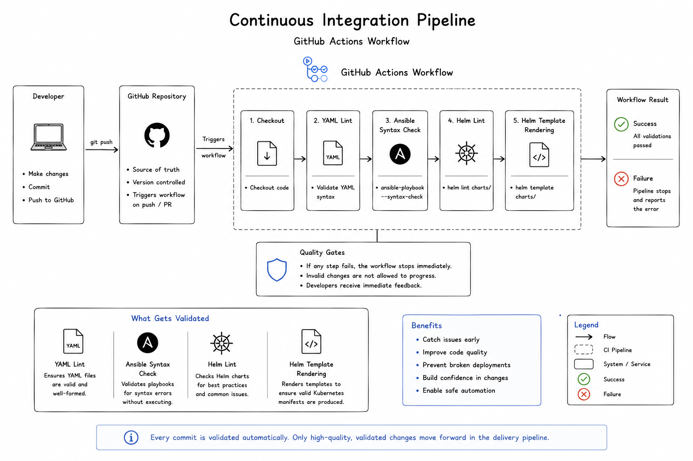

# Continuous Integration

## Purpose

This document describes the Continuous Integration (CI) pipeline used to validate infrastructure and application configuration before changes are introduced into the platform.

The objective of the CI pipeline is to detect configuration errors early, improve deployment quality, and ensure that only validated changes become part of the Git repository.

Continuous Delivery and GitOps deployment are covered separately in the GitOps documentation.

---

## Scope

This document covers:

* Continuous Integration workflow
* GitHub Actions
* Automated validation
* Quality gates
* Design decisions
* Operational principles

---

## Why Continuous Integration?

As infrastructure grows, manually validating every configuration change becomes impractical.

Continuous Integration automates this process by validating every commit before it is merged into the repository.

This provides immediate feedback to the developer while reducing the likelihood of broken infrastructure reaching the deployment stage.

---

## CI Pipeline

  

The CI pipeline executes automatically whenever relevant changes are pushed to the repository.

Each validation step acts as a quality gate before changes progress further through the Platform Engineering workflow.

---

## Current Validation

The current GitHub Actions workflow performs several automated checks.

| Validation              | Purpose                                          |
| ----------------------- | ------------------------------------------------ |
| YAML Lint               | Validate YAML syntax and formatting              |
| Ansible Syntax Check    | Verify playbook correctness                      |
| Helm Lint               | Validate Helm chart structure                    |
| Helm Template Rendering | Confirm Kubernetes manifests render successfully |

These checks execute automatically without requiring manual intervention.

---

## CI Workflow

Every infrastructure change follows the same validation process.

1. Changes are committed locally.
2. The commit is pushed to GitHub.
3. GitHub Actions automatically starts the workflow.
4. Validation tasks execute sequentially.
5. Results are reported back to the repository.
6. Only validated changes proceed to deployment.

This workflow helps detect errors before they affect the running platform.

---

## Quality Gates

Each validation stage represents a quality gate.

Examples include:

* Invalid YAML syntax
* Broken Ansible playbooks
* Incorrect Helm chart structure
* Invalid Kubernetes template rendering

If any validation fails, the workflow stops immediately.

This prevents invalid infrastructure definitions from progressing further through the deployment process.

---

## GitHub Actions

GitHub Actions provides the automation platform responsible for executing the CI workflow.

The workflow definition is stored within the repository, ensuring that validation logic evolves alongside the infrastructure itself.

This keeps automation transparent, reproducible, and version controlled.

---

## Design Decisions

Several architectural decisions shaped the CI implementation.

### Why GitHub Actions?

GitHub Actions integrates directly with the repository while providing a flexible automation platform for infrastructure validation.

It removes the need for dedicated CI servers while remaining easy to extend as the platform grows.

---

### Why Validate Infrastructure?

Infrastructure is software.

Configuration errors should therefore be detected using automated validation before deployment rather than during production operations.

---

### Why Small Validation Steps?

Breaking validation into independent stages makes troubleshooting significantly easier.

When a workflow fails, the failed validation immediately identifies the affected area.

---

## Operational Principles

The Continuous Integration pipeline follows several guiding principles.

* Every commit should be validated automatically.
* Validation should be reproducible.
* Quality checks should execute consistently.
* Failed validation should prevent progression.
* Feedback should be immediate and actionable.

---

## Benefits

The current CI implementation provides several operational advantages.

* Early detection of configuration errors.
* Improved deployment confidence.
* Consistent validation across contributors.
* Reduced manual verification.
* Improved maintainability.
* Version-controlled automation.

Although the current workflow is intentionally lightweight, it establishes the foundation for a more comprehensive Platform Engineering pipeline.

---

## Key Takeaways

* GitHub Actions automatically validates repository changes.
* Infrastructure quality is verified before deployment.
* Multiple validation stages improve reliability.
* CI reduces configuration errors and manual verification.
* Continuous Integration forms the first quality gate in the Platform Engineering workflow.

---

## Related Documentation

The next stage of the platform is described in:

* [06-gitops.md](06-gitops.md)

Supporting technologies are documented in:

* [03-kubernetes.md](03-kubernetes.md)
* [04-ansible.md](04-ansible.md)
