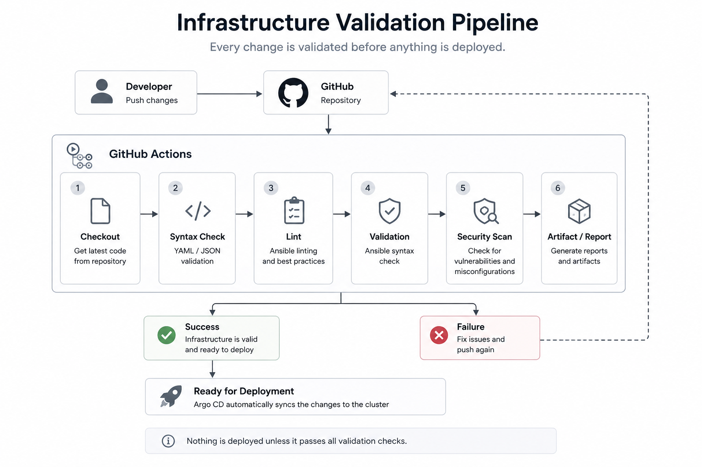

# Continuous Integration

## Purpose

One of the habits I wanted to build while working on this project was validating changes before they reached the platform.

Even in a small homelab, it's easy to introduce YAML mistakes, broken Helm charts, invalid Ansible playbooks or insecure configurations.

Using GitHub Actions means I can catch many of those problems automatically instead of discovering them later when something fails.

---

## CI Workflow

  

Whenever I push changes to GitHub, workflows run automatically.

The pipeline currently performs:

* YAML linting
* Ansible syntax validation
* Helm linting
* Trivy security scanning

This gives me automated validation of both configuration quality and potential security issues before changes are deployed to the platform.

---

## Why GitHub Actions?

Since the rest of the project already lives in GitHub, GitHub Actions felt like a natural choice.

It integrates directly with the repository and makes it easy to validate changes every time I push new code.

For this project, it gives me everything I need without adding unnecessary complexity.

---

## My Workflow

A typical change looks something like this:

1. Make a change locally.
2. Perform relevant local testing.
3. Commit and push it to GitHub.
4. GitHub Actions validates the repository.
5. Review and fix any issues found.
6. Continue with deployment through Argo CD.

This means configuration and security issues can be identified earlier in the deployment process.

---

## Security Scanning with Trivy

As part of introducing DevSecOps practices into the homelab, I added Trivy to the CI workflow.

Trivy automatically scans the repository through GitHub Actions and reports security findings alongside the existing validation checks.

The scan currently operates in report-only mode. Security findings are visible in the CI results, but they do not automatically fail the pipeline.

I chose this approach initially because vulnerability and security findings need to be evaluated in context rather than treating every reported issue as an automatic deployment failure.

As the platform matures, this provides a foundation for introducing security gates based on defined severity levels and policies.

---

## Kubernetes Configuration Scanning

I also use Trivy locally to scan Kubernetes and Helm configuration for security misconfigurations.

The initial scans identified issues such as:

* Containers using default security settings
* Privilege escalation being permitted
* Unrestricted Linux capabilities
* Writable container root filesystems
* Containers without an explicit non-root policy
* Workloads using privileged ports

The `nginx-demo` Helm deployment was used as the first workload for remediation.

Security controls were introduced incrementally, including:

* Preventing privilege escalation
* Dropping unnecessary Linux capabilities
* Using the default runtime seccomp profile
* Making the container root filesystem read-only
* Providing explicit writable temporary volumes where required by NGINX

The deployment already had CPU and memory requests and limits configured.

Implementing the controls incrementally allowed me to test each change and understand its effect instead of simply applying every recommendation produced by the security scanner.

---

## Vulnerability Scanning

Trivy can also scan container images and their dependencies for known vulnerabilities.

I used this functionality manually to examine one of the container images running in the platform and review reported CVEs, including their severity, installed version and available fixed version.

One important lesson from this was that a vulnerability scanner finding does not automatically mean that a vulnerability is exploitable in a specific environment.

The findings still need to be evaluated based on factors such as exposure, affected functionality and whether a patched version is available.

Automated container image scanning is a future improvement for the CI pipeline.

---

## DevSecOps

Adding security scanning changed the pipeline from focusing only on whether infrastructure configuration is technically valid to also considering whether it is securely configured.

The current process can be simplified as:

Git change → GitHub Actions → Validation and security scanning → GitOps deployment

This is my first practical implementation of DevSecOps principles in the homelab.

Rather than treating security as a separate activity performed after deployment, security checks are gradually becoming part of the normal development and deployment workflow.

---

## What I've Learned

Before building this project, I mostly thought of CI as something used in software development.

Working on the homelab changed that perspective.

Even though I'm not compiling an application, validating infrastructure code has been just as valuable.

A missing space in a YAML file or a mistake in a Helm chart can prevent an application from deploying correctly. Similarly, configuration that works technically may still introduce unnecessary security risks.

Automated validation and security scanning help identify both types of problems earlier.

---

## Design Decisions

A few ideas have guided how I built the pipeline.

### Keep Validation Fast

The pipeline should finish quickly.

If validation takes too long, it's tempting to stop using it.

---

### Validate Before Deployment

I'd rather catch configuration mistakes during validation than while trying to debug a running cluster.

This also applies to security issues where problems can potentially be identified before they reach the platform.

---

### Security Findings Need Context

Security scanners can produce many findings with different levels of practical importance.

For that reason, Trivy currently reports findings without automatically blocking the pipeline.

The longer-term goal is to introduce appropriate security gates once I have defined which findings should prevent a deployment.

---

### Start Simple

The pipeline has been built incrementally.

Rather than adding multiple security and validation technologies at once, I prefer introducing a tool when I understand what problem it solves and then expanding its use as the platform matures.

---

## Future Improvements

Some areas I'd like to explore include:

* Automated container image vulnerability scanning
* Defined security gates for CI
* Additional Kubernetes security hardening
* More advanced Kubernetes testing
* Policy-based validation
* Additional linting and quality checks

These will be introduced as the platform and its security requirements evolve.

---

## Key Takeaways

* GitHub Actions automatically validates repository changes.
* YAML, Ansible and Helm configuration are checked as part of CI.
* Trivy introduces automated security scanning into the CI workflow.
* Kubernetes configuration is scanned for security misconfigurations.
* Security findings are currently reported rather than automatically blocking deployments.
* Security recommendations are evaluated and tested rather than applied blindly.
* The pipeline now incorporates basic DevSecOps practices.
* CI and security controls will continue evolving as the platform grows.

---

## Related Documentation

Once changes have been validated, they are deployed through GitOps using Argo CD.

Continue with:

* [06-argocd-gitops.md](06-argocd-gitops.md)
