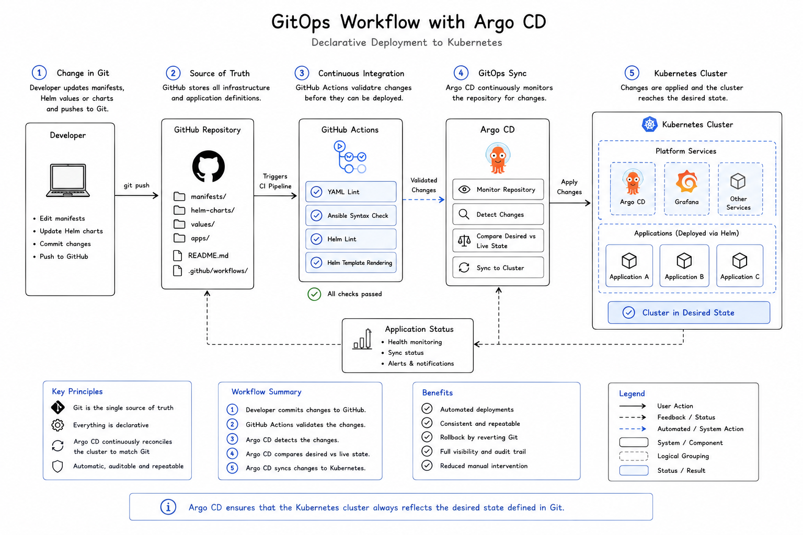

# Argo CD and GitOps

## Purpose

This document describes how Argo CD is used to implement GitOps-based Continuous Delivery within the homelab.

The objective is to maintain the Kubernetes cluster through declarative configuration stored in Git. Rather than deploying applications manually, Argo CD continuously compares the running cluster with the desired state defined in the repository and reconciles any differences.

---

## Scope

This document covers:

* GitOps principles
* Argo CD responsibilities
* Repository-driven deployments
* Desired-state reconciliation
* Drift detection and self-healing
* Rollback strategy
* Design decisions
* Operational principles

Continuous Integration and repository validation are described separately in [05-ci-cd.md](05-ci-cd.md).

---

## Why GitOps?

Traditional deployment workflows often rely on engineers executing commands directly against a target environment.

While manual deployment can be suitable for early experimentation, it introduces several operational challenges:

* Deployments may be difficult to reproduce.
* Changes may not be fully documented.
* The running environment can differ from the repository.
* Rollback procedures may depend on manual intervention.
* Configuration drift can develop over time.

GitOps addresses these challenges by treating Git as the authoritative source of the desired platform state.

Changes are introduced by updating version-controlled configuration rather than modifying the cluster directly.

---

## GitOps Workflow

<p align="center">
  
</p>

The GitOps workflow begins when a developer updates infrastructure or application configuration within the repository.

After the change passes Continuous Integration validation, Argo CD detects the new repository revision and synchronizes the Kubernetes cluster with the declared configuration.

---

## Workflow Overview

The deployment process follows these stages:

1. A developer updates a Kubernetes manifest, Helm chart, or values file.
2. The change is committed and pushed to GitHub.
3. GitHub Actions validates the configuration.
4. Argo CD detects the new revision.
5. Argo CD compares the desired state in Git with the live cluster state.
6. The required Kubernetes changes are applied.
7. Argo CD verifies the synchronization and health status of the application.

The result is a deployment process that is automated, traceable, and repeatable.

---

## Argo CD Responsibilities

Argo CD acts as the GitOps controller for the Kubernetes platform.

Its primary responsibilities include:

* Monitoring Git repositories for changes
* Rendering application configuration
* Comparing desired and live state
* Applying approved changes to Kubernetes
* Detecting configuration drift
* Reporting synchronization status
* Monitoring application health
* Restoring the desired state when self-healing is enabled

Argo CD therefore provides both deployment automation and continuous verification of the running environment.

---

## Desired State

The desired state describes how an application or platform service should be configured.

It may include:

* Kubernetes Deployments
* Services
* Ingress resources
* ConfigMaps
* Helm charts
* Helm values
* Namespace definitions
* Argo CD Application resources

These definitions are stored in Git and reviewed through the same workflow as other source code.

The live Kubernetes cluster is expected to reflect this declared state.

---

## Argo CD Applications

Applications are registered in Argo CD using Kubernetes-native `Application` resources.

An Argo CD Application defines:

* The Git repository to monitor
* The repository revision or branch
* The path containing the application configuration
* The destination Kubernetes cluster
* The target namespace
* The synchronization policy

A simplified example is shown below:

```yaml
apiVersion: argoproj.io/v1alpha1
kind: Application
metadata:
  name: nginx-demo
  namespace: argocd
spec:
  project: default

  source:
    repoURL: https://github.com/KentThylstrupAdel/HomeLab.git
    targetRevision: main
    path: charts/nginx-demo

  destination:
    server: https://kubernetes.default.svc
    namespace: nginx-demo

  syncPolicy:
    automated:
      prune: true
      selfHeal: true

    syncOptions:
      - CreateNamespace=true
```

This resource connects the Helm chart stored in Git with its target namespace in the Kubernetes cluster.

---

## Automated Synchronization

Automated synchronization allows Argo CD to apply repository changes without requiring a manual deployment command.

When a new revision is detected, Argo CD:

1. Reads the application configuration from Git.
2. Renders the required Kubernetes resources.
3. Compares the rendered resources with the live cluster.
4. Applies any required changes.
5. Reports the resulting synchronization and health status.

This reduces manual intervention and ensures that deployment behavior remains consistent.

---

## Drift Detection

Configuration drift occurs when the live environment no longer matches the version-controlled configuration.

Examples include:

* A Kubernetes resource being edited manually
* A replica count being changed directly in the cluster
* A resource being deleted outside the GitOps workflow
* An application configuration being modified without a corresponding Git commit

Argo CD detects these differences by continuously comparing the live state with the desired state.

The application is then marked as out of sync.

---

## Self-Healing

When self-healing is enabled, Argo CD automatically restores manually changed resources to the configuration defined in Git.

For example, if a Deployment is manually scaled from two replicas to five while Git still defines two replicas, Argo CD can restore the replica count to two.

This reinforces Git as the authoritative source of truth and reduces long-term configuration drift.

---

## Pruning

Pruning allows Argo CD to remove Kubernetes resources that no longer exist in the repository.

Without pruning, deleting a manifest from Git would not necessarily remove the existing resource from the cluster.

With automated pruning enabled:

1. A resource definition is removed from Git.
2. Argo CD detects that the resource is no longer part of the desired state.
3. The corresponding live Kubernetes resource is removed.

Pruning should be used deliberately because repository changes can directly delete running resources.

---

## Rollback Strategy

Git provides the primary rollback mechanism.

To restore a previous application state:

1. Revert the relevant Git commit.
2. Push the reverted configuration to the repository.
3. Allow Continuous Integration to validate the change.
4. Argo CD detects the previous desired state.
5. The cluster is reconciled accordingly.

This provides a version-controlled and auditable rollback process.

Argo CD also maintains application history, but Git remains the authoritative record of why the configuration changed.

---

## Bootstrap Process

Argo CD introduces a small bootstrap requirement.

Before Argo CD can manage an application, the corresponding Argo CD `Application` resource must exist in the cluster.

The initial Application resource may therefore be applied manually:

```bash
kubectl apply -f argocd/applications/nginx-demo.yaml
```

After this one-time bootstrap, the application itself is managed through GitOps.

A future improvement may introduce an app-of-apps or ApplicationSet pattern so that Argo CD application definitions are also discovered and managed automatically.

---

## Relationship Between CI and GitOps

Continuous Integration and GitOps perform different responsibilities.

| Stage                  | Tool           | Responsibility                                    |
| ---------------------- | -------------- | ------------------------------------------------- |
| Continuous Integration | GitHub Actions | Validate repository changes                       |
| Continuous Delivery    | Argo CD        | Synchronize validated configuration to Kubernetes |
| Runtime                | Kubernetes     | Run the declared workloads                        |

GitHub Actions answers:

> Is this configuration structurally valid?

Argo CD answers:

> Does the running cluster match the desired state in Git?

Together they provide an automated path from repository change to running workload.

---

## Security and Access Model

Argo CD pulls configuration from Git and applies it from inside the Kubernetes cluster.

This has several advantages:

* External CI runners do not require direct administrative access to the cluster.
* Kubernetes credentials do not need to be stored in GitHub Actions.
* Deployment responsibility remains inside the cluster.
* Access can be controlled using Kubernetes RBAC and Argo CD projects.

Sensitive values should not be stored directly in Git.

Future secret-management improvements may include:

* External Secrets Operator
* Sealed Secrets
* HashiCorp Vault
* SOPS-encrypted configuration

---

## Design Decisions

### Why Argo CD?

Argo CD is purpose-built for declarative Kubernetes delivery and provides a clear view of application health, synchronization status, and configuration drift.

It also uses Kubernetes-native resources, which aligns well with the architecture of the homelab.

---

### Why Pull-Based Deployment?

In a pull-based model, Argo CD operates inside the cluster and retrieves the desired state from Git.

This avoids granting an external CI service direct deployment credentials and creates a clearer separation between validation and deployment.

---

### Why Automated Synchronization?

Automated synchronization reduces repetitive manual deployments and ensures repository changes are applied consistently.

It also makes the Git workflow the normal operational path for application changes.

---

### Why Enable Self-Healing?

Self-healing prevents undocumented manual changes from becoming permanent.

This helps preserve configuration consistency and reinforces the repository as the authoritative source.

---

### Why Use Git for Rollback?

Reverting a Git commit provides a transparent and auditable rollback mechanism.

It records both the original change and its reversal while allowing the normal CI and GitOps processes to remain in effect.

---

## Operational Principles

The GitOps workflow follows several guiding principles:

* Git is the authoritative source of desired state.
* Application changes should be introduced through commits.
* Direct cluster changes should be avoided.
* Deployments should be declarative and reproducible.
* Configuration drift should be detected automatically.
* Rollbacks should use version-controlled configuration.
* Secrets should never be committed in plain text.
* Deployment status should be observable through Argo CD.

---

## Current Implementation

The current implementation includes:

* Argo CD deployed inside the k3s cluster
* Application definitions stored in the repository
* Helm-based application sources
* Automated synchronization
* Resource pruning
* Self-healing
* Namespace creation through synchronization options
* GitHub Actions validation before deployment

This establishes a complete workflow from code change to reconciled Kubernetes workload.

---

## Future Improvements

Potential improvements include:

* App-of-apps repository structure
* ApplicationSet-based application discovery
* Separate development and production environments
* Promotion between environment branches or directories
* Argo CD Projects for stronger access boundaries
* Single sign-on
* Notifications for failed synchronization
* Automated image updates
* Policy validation before synchronization
* External secret management

These enhancements can be introduced incrementally as the platform becomes more complex.

---

## Key Takeaways

* Git defines the desired state of the Kubernetes platform.
* GitHub Actions validates changes before deployment.
* Argo CD continuously compares Git with the live cluster.
* Automated synchronization applies approved changes consistently.
* Self-healing reduces configuration drift.
* Pruning removes resources that have been deleted from Git.
* Rollbacks are performed by reverting version-controlled configuration.
* The pull-based model keeps deployment credentials inside the cluster.

---

## Related Documentation

Previous documentation:

* [02-architecture.md](02-architecture.md)
* [03-kubernetes.md](03-kubernetes.md)
* [05-ci-cd.md](05-ci-cd.md)

Continue with:

* [07-monitoring.md](07-monitoring.md)
* [08-roadmap.md](08-roadmap.md)
