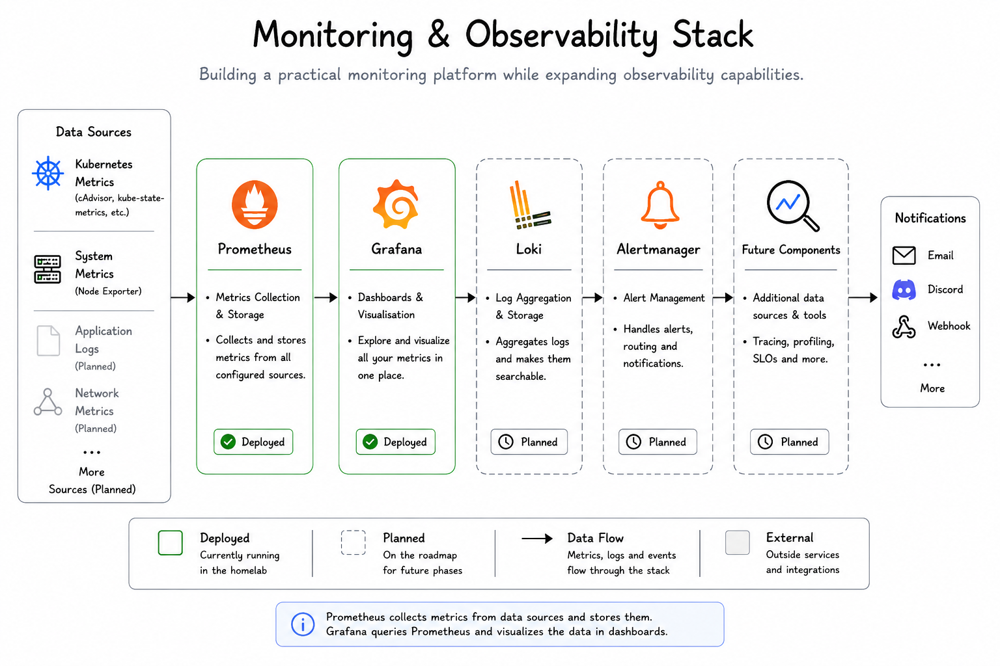

# Monitoring

## Purpose

Monitoring is one of the next areas I want to spend time learning.

I've already deployed Grafana as part of the platform, but I currently see it as a foundation rather than a finished monitoring solution.

My goal is to gradually build experience with monitoring and observability as the homelab grows.

---

## Current Status

  

Grafana has been deployed successfully and is accessible within the cluster.

At the moment, I'm mainly using it to become familiar with the interface and understand how monitoring fits into a Platform Engineering environment.

I haven't yet built meaningful dashboards, configured alerts or integrated additional monitoring components.

Those are all part of the next stage of the project.

---

## Why Grafana?

I chose Grafana because it's one of the most widely used monitoring tools in the industry and integrates with many different data sources.

Since it's commonly used in Kubernetes environments, it felt like a good place to start learning about observability.

---

## Why Monitoring?

Until now, most of my focus has been on building and automating the platform.

The next logical step is understanding how to monitor it.

Rather than waiting until something breaks, I'd like to be able to answer questions like:

* Is the cluster healthy?
* Are resources being used as expected?
* Has something changed recently?
* Are applications behaving normally?

Monitoring helps answer those questions.

---

## Current Focus

Right now, monitoring is very much a work in progress.

My immediate goal isn't to build a complete monitoring stack, but simply to become comfortable using Grafana and understanding how it fits into the overall platform.

Once that foundation is in place, I'll gradually expand it.

---

## Planned Improvements

Some of the things I'd like to explore next include:

* Prometheus for metrics collection
* Loki for log aggregation
* Alertmanager for notifications
* More useful Grafana dashboards
* Platform health monitoring
* Basic alerting

These aren't implemented yet, but they represent the direction I'd like to take the project.

---

## Lessons Learned

One thing this project has taught me is that Platform Engineering isn't only about deploying infrastructure.

It's also about understanding what's happening after it's been deployed.

I'm only at the beginning of that journey, but monitoring is an area I'm looking forward to exploring further.

---

## Key Takeaways

* Grafana is installed and running as part of the platform.
* Monitoring is currently a learning area rather than a completed feature.
* The focus is on building a solid foundation before adding more advanced capabilities.
* Prometheus, Loki and Alertmanager are planned future additions.
* This chapter will evolve as the monitoring stack becomes more capable.

---

## Related Documentation

The next chapter describes how the different parts of the platform communicate.

Continue with:

* [08-network.md](08-network.md)
