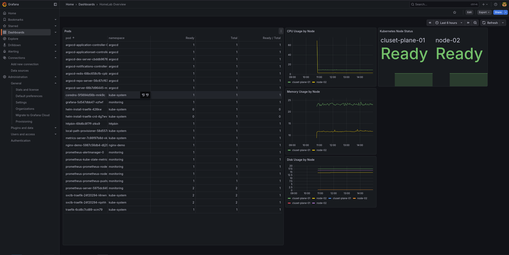

# Monitoring

## Purpose

Monitoring gives me visibility into how the platform behaves after it has been deployed.

The goal of this part of the homelab is not to build a complete observability platform, but to understand the fundamentals of collecting metrics, visualising them and using them to spot problems.

---

## Current Status

The homelab now has a working monitoring setup using Prometheus and Grafana.

Prometheus collects metrics from the Kubernetes cluster, while Grafana is used to visualise them.

Grafana is exposed through Traefik Ingress at:

`http://grafana.homelab`

This address is only available inside my air-gapped homelab network and cannot be accessed externally.

  

---

## Homelab Overview Dashboard

The current dashboard is deliberately simple and focuses on the information I would want to check first when looking at the cluster.

It currently shows:

- Kubernetes node status
- Pod readiness
- CPU usage by node
- Memory usage by node
- Disk usage by node

The dashboard configuration is version-controlled and stored in:

`grafana/dashboards/homelab-overview.json`

This means the dashboard itself is treated as part of the platform configuration rather than something that only exists inside the Grafana UI.

---

## Monitoring Architecture

  

The monitoring stack currently consists of:

- Prometheus for collecting and storing metrics
- Grafana for dashboards and visualisation
- Node Exporter for host-level metrics
- kube-state-metrics for Kubernetes object metrics

Grafana and Prometheus are both deployed and running.

Loki, Alertmanager and additional observability components are still planned for later.

---

## Why Prometheus and Grafana?

I chose Prometheus and Grafana because they are commonly used together in Kubernetes environments and gave me a practical way to learn how monitoring actually fits into a platform.

Prometheus handles the metric collection, while Grafana gives me a way to turn that data into something useful.

That separation helped make the monitoring flow much easier to understand.

---

## What I've Learned

Before adding Prometheus, Grafana was essentially just an empty interface.

Once Prometheus was connected as a data source, the relationship became much clearer:

`Infrastructure → Metrics → Prometheus → Grafana`

Building the dashboard also helped me understand that monitoring is not just about collecting as much data as possible.

The useful part is deciding which information helps answer operational questions such as:

- Are both Kubernetes nodes healthy?
- Are the Pods ready?
- Is one node using unusually high CPU or memory?
- Is disk usage becoming a problem?

---

## Current Focus

The current setup gives me a basic operational view of the cluster.

I want to keep the monitoring solution relatively simple while I become more comfortable with Prometheus queries, Grafana dashboards and the general monitoring workflow.

The next step is to gradually expand from infrastructure metrics into broader observability.

---

## Planned Improvements

Future improvements include:

- Loki for centralised log aggregation
- Alertmanager for alerts and notifications
- Additional Grafana dashboards
- Application-level metrics
- Basic alerting for critical components
- More advanced Prometheus queries

These are planned improvements rather than features currently implemented.

---

## Key Takeaways

- Prometheus collects metrics from the Kubernetes environment.
- Grafana provides a visual overview of cluster health and resource usage.
- The dashboard configuration is stored in Git.
- Grafana is exposed through Traefik Ingress inside the homelab network.
- Logging and alerting are the next major monitoring areas I want to explore.

---

## Related Documentation

The next chapter describes how the different parts of the platform communicate.

Continue with:

- [08-network.md](08-network.md)
