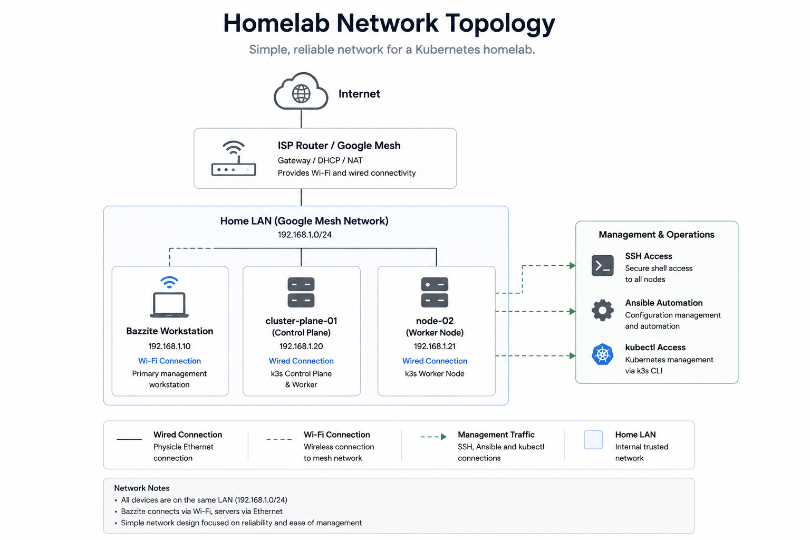

# Network Architecture

## Purpose

This document describes the network architecture of the Platform Engineering homelab.

The network provides connectivity between the management workstation, Kubernetes nodes, platform services, and deployed applications. Its design supports secure infrastructure administration, internal cluster communication, and future external access to Kubernetes workloads.

Specific IP addresses and other environment-sensitive details are intentionally excluded from the public documentation.

---

## Scope

This document covers:

* Physical and logical network topology
* Management access
* Kubernetes cluster networking
* Pod and Service communication
* Application exposure
* DNS and ingress strategy
* Security considerations
* Planned network improvements

Detailed host-specific information is maintained separately from the public repository.

---

## Network Overview

<p align="center">
  
</p>

The homelab operates on a private local network.

The management workstation communicates with the Kubernetes nodes over the local network using SSH and Kubernetes management tools. Kubernetes provides an additional software-defined network for communication between Pods, Services, and cluster components.

The network architecture can therefore be divided into two primary layers:

| Layer              | Purpose                                                                   |
| ------------------ | ------------------------------------------------------------------------- |
| Physical network   | Connectivity between the workstation, servers, and network infrastructure |
| Kubernetes network | Communication between Pods, Services, nodes, and platform components      |

---

## Network Components

The environment currently consists of three primary systems.

| Component           | Role                                   |
| ------------------- | -------------------------------------- |
| Bazzite workstation | Management and engineering workstation |
| `cluster-plane-01`  | Kubernetes control-plane node          |
| `node-02`           | Kubernetes worker node                 |

All systems are connected to the same private local network.

The workstation is not part of the Kubernetes cluster. It acts as an external management system from which infrastructure automation and cluster administration are performed.

---

## Management Network

The Bazzite workstation is the primary administrative entry point into the environment.

Management traffic includes:

* SSH connections
* Ansible automation
* Kubernetes API communication
* Helm operations
* Git-based administration
* Access to platform web interfaces

Engineering tools are executed from the `ansible-box` Distrobox environment on the workstation.

This separates the administrative tooling from the immutable Bazzite host operating system while retaining direct access to the local network.

---

## SSH Access

The workstation connects to both Kubernetes nodes using SSH key authentication.

```text
Bazzite workstation
        |
        | SSH key authentication
        |
        +----> cluster-plane-01
        |
        +----> node-02
```

SSH is used for:

* Operating system administration
* Ansible execution
* Troubleshooting
* Reviewing system services
* Initial platform bootstrapping

Passwordless SSH authentication allows Ansible to connect to managed hosts without requiring interactive login credentials for every task.

Privilege escalation may still require controlled `sudo` access depending on the operation being performed.

---

## Kubernetes API Access

Cluster administration is performed through the Kubernetes API server running on the control-plane node.

The workstation uses `kubectl` and Helm to communicate with the API server.

```text
kubectl / Helm
      |
      v
Kubernetes API Server
      |
      v
Cluster resources
```

The Kubernetes configuration file defines:

* Cluster endpoint
* Authentication material
* Cluster certificate authority
* User context
* Default namespace context

Access to this configuration must be protected because it may grant administrative privileges within the cluster.

---

## Cluster Communication

The control-plane and worker nodes communicate continuously as part of normal Kubernetes operation.

This communication supports:

* Node registration
* Pod scheduling
* Workload status reporting
* Kubernetes API requests
* Cluster state management
* Service discovery
* Container network communication

The worker node reports its condition and workload status to the control plane, while the control plane schedules and manages workloads across the cluster.

Reliable communication between the nodes is therefore essential to cluster operation.

---

## Kubernetes Networking

Kubernetes introduces a logical network above the physical local network.

This logical network allows workloads to communicate without depending directly on the physical IP address of the node on which each Pod is running.

The Kubernetes networking model includes:

* Node networking
* Pod networking
* Service networking
* Cluster DNS
* Ingress and external access

---

## Pod Network

Each Pod receives an internal cluster address.

The Pod network enables:

* Pod-to-Pod communication
* Communication between workloads on different nodes
* Access to cluster services
* Internal platform communication

k3s uses Flannel as its default Container Network Interface implementation unless configured otherwise.

Flannel provides the network overlay that allows Pods to communicate across cluster nodes.

Pod addresses are considered temporary. Applications should therefore not depend directly on individual Pod IP addresses.

---

## Service Network

Kubernetes Services provide stable virtual endpoints for groups of Pods.

A Service allows applications to communicate with a workload without knowing:

* Which Pod currently hosts it
* Which node the Pod is running on
* Whether the Pod has been recreated
* Whether the workload has multiple replicas

Common Service types include:

| Service type   | Purpose                                                |
| -------------- | ------------------------------------------------------ |
| `ClusterIP`    | Internal cluster access                                |
| `NodePort`     | Exposes a port through each node                       |
| `LoadBalancer` | Requests an externally reachable load-balancer address |
| `ExternalName` | Maps a Service to an external DNS name                 |

Most internal platform communication should use `ClusterIP` Services.

---

## Cluster DNS

Kubernetes provides internal DNS-based service discovery through CoreDNS.

Applications can access Services using names rather than addresses.

For example:

```text
grafana.monitoring.svc.cluster.local
```

This identifies:

* Service: `grafana`
* Namespace: `monitoring`
* Resource type: Kubernetes Service
* Cluster domain: `cluster.local`

Within the same namespace, an application may normally use only the Service name:

```text
grafana
```

DNS-based service discovery makes application communication more stable and independent of changing Pod addresses.

---

## Application Exposure

Applications inside Kubernetes are not automatically accessible from outside the cluster.

External access requires an exposure mechanism such as:

* NodePort
* LoadBalancer
* Ingress
* Port forwarding

Temporary administrative access can be established using port forwarding:

```bash
kubectl port-forward service/<service-name> <local-port>:<service-port>
```

Port forwarding is useful for testing and troubleshooting but is not intended as the permanent access method for platform services.

---

## Ingress Strategy

Ingress provides HTTP and HTTPS routing into the cluster.

A future ingress design will allow multiple services to share a common entry point while being addressed through separate hostnames.

Example:

```text
grafana.homelab.internal
argocd.homelab.internal
demo.homelab.internal
```

The intended request flow is:

```text
Client
  |
  v
DNS
  |
  v
External cluster address
  |
  v
Ingress controller
  |
  v
Kubernetes Service
  |
  v
Application Pods
```

This is preferable to exposing every application through a separate port on a Kubernetes node.

---

## Ingress Controller

An ingress controller implements the routing rules defined by Kubernetes Ingress resources.

The planned architecture includes an ingress controller responsible for:

* Host-based routing
* Path-based routing
* TLS termination
* Routing traffic to Kubernetes Services
* Providing a shared application entry point

k3s includes Traefik by default unless it is disabled during installation.

The final ingress implementation should reflect the actual cluster configuration rather than assuming that a specific controller is installed.

---

## Load Balancing

Cloud-based Kubernetes environments typically integrate with a provider-managed load balancer.

A physical homelab does not have this integration by default.

MetalLB is planned to provide `LoadBalancer` functionality within the local network.

MetalLB can allocate addresses from a dedicated private address pool and advertise them on the local network.

This would allow services such as an ingress controller to receive a stable network address without relying on NodePort access.

---

## DNS Strategy

Human-readable internal names make platform services easier to access and document.

A future internal DNS solution may provide records such as:

```text
grafana.homelab.internal
argocd.homelab.internal
```

Potential DNS approaches include:

* Local router DNS entries
* Pi-hole
* AdGuard Home
* A dedicated internal DNS server
* Static host entries for limited testing

A centralized DNS service is preferable to maintaining separate host-file entries on every client.

The chosen internal domain should avoid conflicting with public DNS names owned by other organizations.

---

## TLS and Certificate Management

Once applications are accessed through stable DNS names, TLS can protect communication between clients and platform services.

The planned certificate architecture includes `cert-manager`, which can automate:

* Certificate requests
* Certificate renewal
* Kubernetes TLS Secret creation
* Integration with certificate issuers

For a private homelab, certificate sources may include:

* An internal certificate authority
* Self-signed certificates
* A public certificate authority where domain validation is possible

The final design should balance trust, operational complexity, and accessibility from local devices.

---

## Network Security

The current environment uses a trusted private network, but private networking alone should not be treated as a complete security boundary.

Important controls include:

* SSH key authentication
* Restricted administrative access
* Protected Kubernetes credentials
* Limited service exposure
* Host firewalls
* Kubernetes RBAC
* Network Policies
* TLS for web interfaces
* Secure secret management

Only services that require external access should be exposed outside the Kubernetes cluster.

Administrative components such as the Kubernetes API server should remain restricted to trusted management systems.

---

## Network Policies

By default, Kubernetes workloads may be able to communicate broadly within the cluster, depending on the installed network implementation.

Network Policies can restrict communication between Pods and namespaces.

Example policy objectives include:

* Allowing frontend Pods to access a backend Service
* Preventing application namespaces from accessing monitoring components
* Restricting database access to approved workloads
* Denying unnecessary cross-namespace communication

Network Policies are planned as the platform grows and more workloads are introduced.

Their enforcement depends on support from the installed Container Network Interface.

---

## Public Documentation and Sensitive Information

Private infrastructure information should not be stored in public documentation unless it is necessary and safe to disclose.

The public repository intentionally excludes:

* Private IP addresses
* MAC addresses
* Router configuration
* External IP addresses
* Wi-Fi information
* SSH public-key inventories
* Firewall rules containing sensitive source addresses
* Credentials and tokens

Public documentation describes roles and communication paths rather than exact addressing.

Host-specific details may be maintained in a private inventory outside the public repository.

---

## Troubleshooting Approach

Network troubleshooting should move systematically through each layer.

### Physical and Host Connectivity

Confirm that the systems can communicate on the local network:

```bash
ping <hostname-or-address>
```

### SSH Connectivity

Confirm administrative access:

```bash
ssh <user>@<hostname>
```

### Kubernetes Node Status

Confirm that nodes are connected to the cluster:

```bash
kubectl get nodes -o wide
```

### Pod Status

Review running workloads:

```bash
kubectl get pods --all-namespaces -o wide
```

### Service Status

Review Service definitions and endpoints:

```bash
kubectl get services --all-namespaces
kubectl get endpoints --all-namespaces
```

### DNS Resolution

Test internal DNS from a workload:

```bash
kubectl run dns-test \
  --rm \
  --restart=Never \
  --image=busybox:1.36 \
  -- nslookup kubernetes.default.svc.cluster.local
```

### Ingress

Review ingress resources and controller logs:

```bash
kubectl get ingress --all-namespaces
kubectl logs --namespace <namespace> <ingress-controller-pod>
```

This layered approach helps distinguish physical network problems from Kubernetes networking or application configuration issues.

---

## Design Decisions

### Why Use a Separate Management Workstation?

A separate workstation provides a controlled administrative entry point and prevents infrastructure management from depending on direct console access to the servers.

---

### Why Keep the Nodes on the Same Private Network?

A shared private network simplifies initial cluster communication and administration while the platform remains small.

More advanced segmentation can be introduced when it provides a clear operational or security benefit.

---

### Why Use Kubernetes Services?

Services provide stable discovery and load distribution even when Pods are recreated or moved between nodes.

---

### Why Introduce Ingress?

Ingress provides a consistent HTTP and HTTPS entry point while avoiding a growing collection of manually managed ports.

---

### Why Plan for MetalLB?

MetalLB provides load-balancer behavior in an environment without a cloud provider integration.

This allows the homelab to reproduce common Kubernetes service-exposure patterns on physical infrastructure.

---

### Why Avoid Publishing IP Addresses?

Exact addresses add little architectural value and disclose unnecessary details about the private environment.

Role-based diagrams communicate the design more clearly and remain valid if addressing changes.

---

## Current Implementation

The current network implementation includes:

* A private local network
* A Bazzite management workstation
* SSH key access to both Kubernetes nodes
* Ansible management over SSH
* Kubernetes API access from the workstation
* k3s cluster networking
* Flannel Pod networking
* CoreDNS service discovery
* Internal Kubernetes Services
* Temporary access through Kubernetes port forwarding where required

---

## Planned Improvements

The network architecture will be expanded incrementally with:

* A stable ingress implementation
* MetalLB for local load balancing
* Internal DNS records
* Automated TLS certificates
* Kubernetes Network Policies
* Host firewall review
* Improved namespace isolation
* Monitoring of network traffic and service availability
* Potential network segmentation
* Documented backup access procedures

These changes should be introduced only after the underlying use case and security requirements are understood.

---

## Key Takeaways

* The workstation acts as the primary management entry point.
* SSH and Ansible are used to administer the Kubernetes nodes.
* Kubernetes provides separate Pod, Service, and DNS networking layers.
* Services provide stable access to workloads despite changing Pods.
* Ingress and MetalLB are planned to provide structured external access.
* Internal DNS and TLS will make platform services easier and safer to access.
* Sensitive addressing details are intentionally excluded from the public repository.
* Network security will be strengthened incrementally through restricted exposure, RBAC, firewalls, and Network Policies.

---

## Related Documentation

Previous documentation:

* [02-architecture.md](02-architecture.md)
* [03-kubernetes.md](03-kubernetes.md)
* [04-ansible.md](04-ansible.md)
* [06-argocd-gitops.md](06-argocd-gitops.md)
* [07-monitoring.md](07-monitoring.md)

Continue with:

* [08-roadmap.md](08-roadmap.md)
