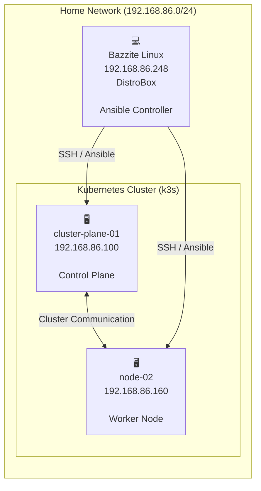

# Homelab Architecture

## Overview

This document describes the current architecture of my homelab.

## Infrastructure

| Hostname | Operating System | IP Address | Role |
|----------|------------------|------------|------|
| Bazzite Workstation | Bazzite Linux | 192.168.86.248 | Workstation & Ansible Controller |
| cluster-plane-01 | Ubuntu Server | 192.168.86.100 | Kubernetes (k3s) Control Plane |
| node-02 | Ubuntu Server | 192.168.86.160 | Kubernetes (k3s) Worker Node |

---

## Architecture Diagram

---

## Components

### Bazzite Linux
This was a terrible idea for distro, as the OS-Core is read only, so all apps I need, need to be in containers, in this case DistroBox
- Daily workstation
- Runs Ansible
- SSH access to infrastructure
    - Public key copied to servers, to enable seemless SSH conectivity
- Used for cluster management

### cluster-plane-01

- Ubuntu Server
- k3s Control Plane
- Kubernetes API Server
- Cluster management

### node-02

- Ubuntu Server
- k3s Worker Node
- Runs Kubernetes workloads

---

## Future Expansion as proposed by the incredible internet!

Planned additions:

- [ ] Longhorn
- [ ] MetalLB
- [ ] Traefik
- [ ] cert-manager
- [ ] Argo CD
- [ ] Prometheus
- [ ] Grafana
- [ ] Loki
- [ ] Pi-hole
- [ ] NAS
- [ ] GitHub Actions
