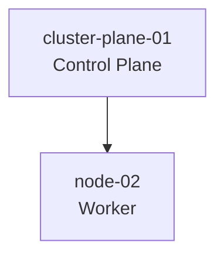

# Kubernetes Cluster

## Distribution

- k3s

## Cluster Nodes

| Node | Role |
|------|------|
| cluster-plane-01 | Control Plane |
| node-02 | Worker |

## Cluster Topology

## Planned Services

- Traefik
- cert-manager
- Longhorn
- MetalLB
- Argo CD
- Prometheus
- Grafana
- Loki
